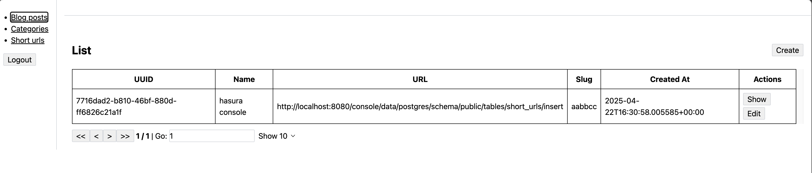
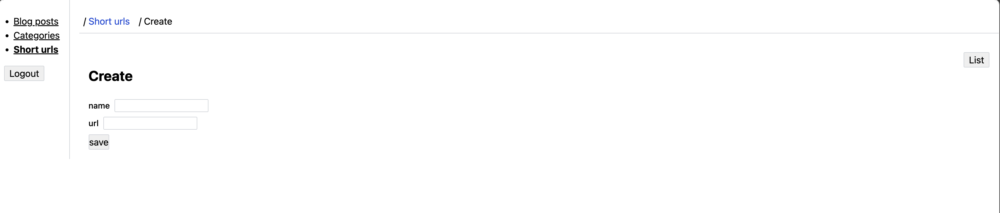

# Another URL Shortener

## Features

- Auth0
- CRUD for Short URL with GRAPHQL
- CRUD for Short URL with REST
- Prisma for DB migration
- Hasura backend for fast prototyping and data modeling
- 

## Production

> **WARNING**
> When doing this you need to be sure that the length of the IDs you are creating is sufficient 
> to avoid collisions over time as the number of objects you've created grows, which can be 
> counter-intuitive because of the Birthday Paradox. So you will likely want a length 
> greater (or much greater) than 10 for any reasonably commonly created object.

[Look for `CREATE TABLE "short_urls"`](./backend/prisma/migrations/20250421162346_init/migration.sql)